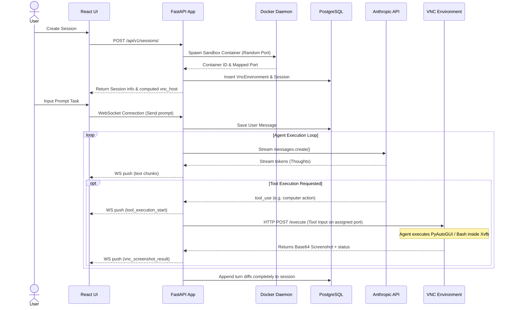
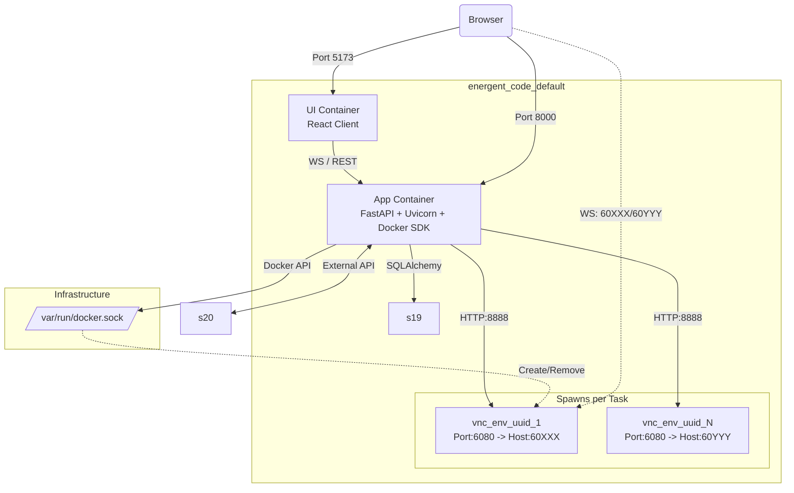

# Energent Code: Computer Use Demo

Author: **Mario Reyes Ojeda**

A specialized AI Agent architecture that performs actions on a virtual desktop environment using Anthropic's Claude 3.5/3.7 Sonnet Computer Use capabilities.

The project manages isolated VNC sandbox environments locally, orchestrating them alongside a modernized React tracking UI and a FastAPI control plane.

## Technical Specifications & Component Integration

The application is structured into four main isolated components, leveraging Docker Compose:

1. **Frontend UI (`ui`)**: A React/Vite web application using Zustand and tailwindcss. Served statically via Nginx in production, it offers a 3-pane dashboard: Tasks Sidebar, live VNC Viewer, and an Execution Loop agent chat.
2. **Backend App (`app`)**: A Python-based FastAPI web server. It manages PostgreSQL connections using SQLAlchemy, exposes REST endpoints for Session managing, and WebSocket streams for real-time agent/user interactions.
3. **Database (`db`)**: A PostgreSQL 15 relational database storing session histories, chat sequences, and agent tool execution tokens.
4. **Dynamic VNC Environments**: Rather than a static container, the FastAPI backend acts as an orchestrator using the Docker Engine SDK. For each new agent task, it dynamically spawns an isolated container based on `ghcr.io/anthropics/anthropic-quickstarts:computer-use-demo-latest`. Each container runs its own Xvfb virtual display, noVNC proxy, and a custom Python tool server accessible via uniquely mapped host ports.

### Session Manager & Request Loop Sequence

The following sequence details how the system creates sessions, requests thoughts from Claude, and safely proxies tool executions to the isolated VNC target.



### Deployment Pattern Architecture

Below is the Docker service mapping and network integration pattern:



## Setup & Deployment Instructions

You will need Docker and Docker Compose installed on your host system.

### 1. Environment Variables

Create a `.env` file from the provided baseline:

```bash
cp .env.example .env
```

Edit `.env` and configure your keys (specifically `ANTHROPIC_API_KEY`).

### 2. Standard Deployment

To build and start all integrated Docker services locally, use the provided `Makefile`:

```bash
# Starts all containers in detached mode, provisioning the images
make up
```

Once running, the components are accessible at:

- **Main React Dashboard**: [http://localhost:5173](http://localhost:5173)
- **FastAPI Backend (Swagger Docs)**: [http://localhost:8000/docs](http://localhost:8000/docs)
- **VNC Streams**: Rendered dynamically within the React UI mapped directly to transient Docker ports.

### 3. Log Observation

To stream and parse the aggregate logs from all active microservices:

```bash
make logs
```

### 4. Teardown

To cleanly stop and remove the Docker containers, networks, and environment links:

```bash
make down
```

## Local Development Requirements (Optional)

If you wish to make changes to the backend or the frontend locally (outside of Docker), you can run the dependencies natively:

**For the Python Backend:**

```bash
uv sync            # Installs backend dependencies
make check         # Run ty type checker
make lint          # Run ruff linter
make format        # Format code with ruff
make test          # Run pytest
make all           # Lint + Check + Test sequentially
```

**For the React Frontend:**

```bash
make ui-install    # Installs JS dependencies in src/ui
make ui            # Starts local Vite development server
```
